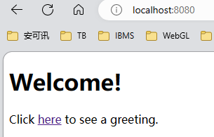

## 概述

使用受 Spring 安全性保护的资源创建简单 Web 应用程序的过程。
构建一个Spring MVC应用程序，该应用程序使用由固定用户列表支持的登录表单来保护页面。
“依赖项”：“Spring Web”和“Thymeleaf”
Web应用程序基于Spring MVC。因此，您需要配置 Spring MVC 并设置视图控制器(模板引擎)以公开这些模板。
实用型比较强，加入了spring-boot-starter-security和spring-security-test

## 注意
注意模板引擎的模板文件(类似JSP)都是放在resources/templates下,
templates是模板文件目录，注意它们不再存放在src/main/webapp下，而是直接放到src/main/resources这个classpath目录，因为在Spring
Boot中已经不需要专门的webapp目录了

### 主页，如下图所示：

http://localhost:8080

### 当您单击该链接时，它会尝试将您带到 /hello的问候页面。但是，由于该页面是安全的，并且您尚未登录，因此它会将您带到登录页面，如下图所示：

http://localhost:8080/login

### 在登录页面上，分别输入用户名user和密码字段password，以测试用户身份登录。提交登录表单后，您将进行身份验证，然后转到问候页面，如下图所示：

http://localhost:8080/hello

