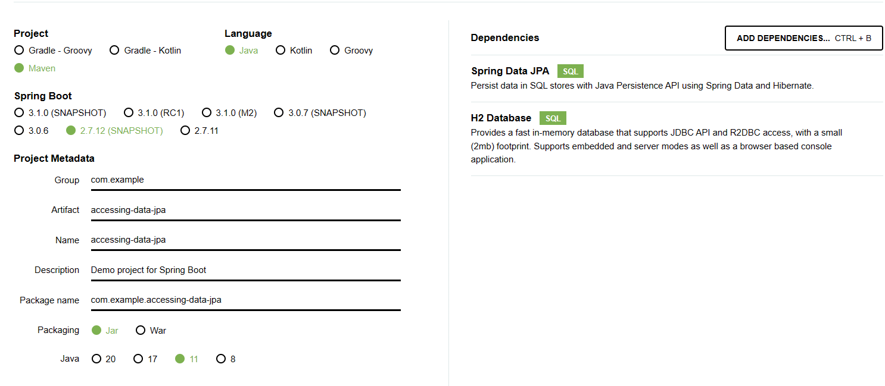

使用JPA访问数据，简单实体(@Entity,@Id/@GeneratedValue(strategy=GenerationType.AUTO))，简单查询类(CrudRepository)
，应用程序类(@Bean，CommandLineRunner，org.slf4j.LoggerFactory)，启动时启动器-加载bean，直接在命令行执行并日志输出H2库中的操作数据

# 创建

# 启动加载bean输出日志

