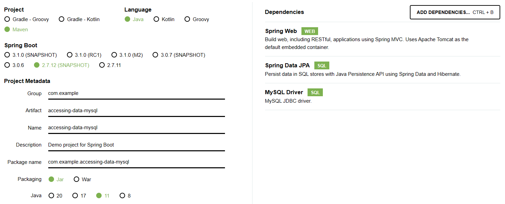
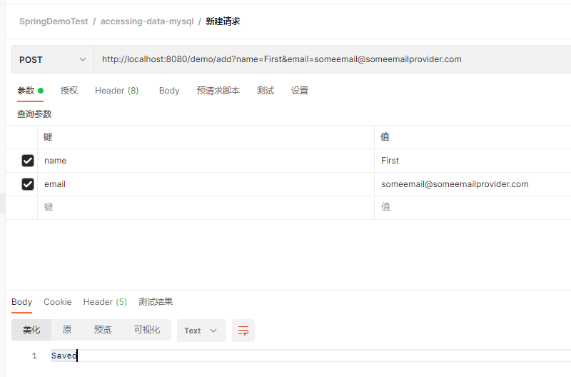
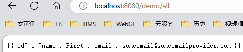

# 技术特点：JPA+Mysql。

'@Controller,@Repository(Dao)，@Entity，挺实用的，

## 注意点：

spring.jpa.hibernate.ddl-auto生产环境为none，开发环境为update

## 三种依赖Spring Web，Spring Data JPA和MySQL驱动程序。

## 建库

## 使用Postman创建用户

## 查询所有用户

