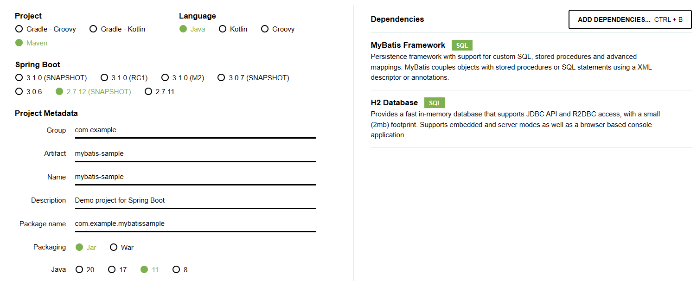
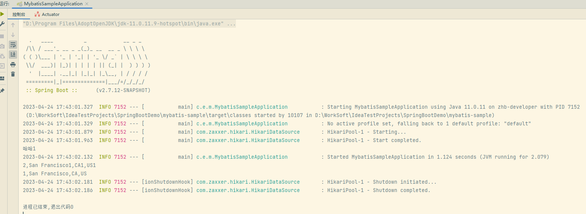
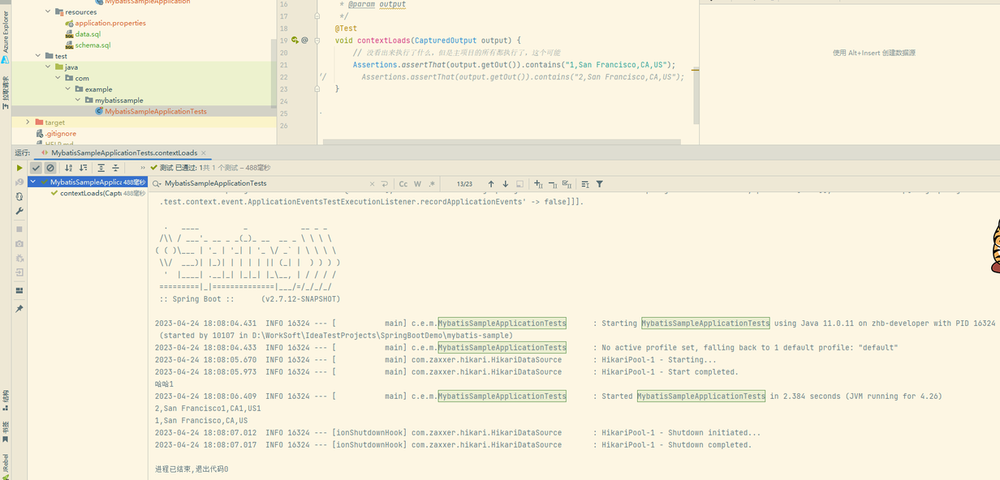

## Mybatis+H2

不需要@Entity，@Repository(Dao)->@Mapper，需要@Controller，实用

## 创建项目

两种依赖MyBatis Framework，H2 Database

## 演示springboot启动项目执行sql逻辑，schema.sql/data.sql

1、sql文件的命名规则：
● schema-(platform).sql或者schema.sql或者data-(platform).sql或者data.sql。
● 以schema命名的用于CREATE，建表SQL，优先执行。
● 以data命名的用于INSERT、UPDATE等修改数据的SQL，次要执行。

## 正常运行

## @Test执行：测试执行能看到执行的文件不一样，其他都差不多

