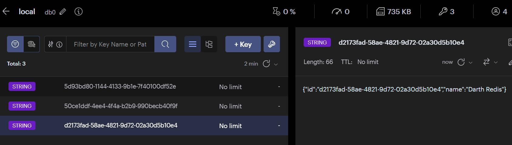

使用 Redis 以反应方式访问数据。应用程序使用 Spring Data Redis 和 Project Reactor 与 Redis 数据存储进行交互，在不阻塞的情况下存储和检索对象。Spring Reactive Web，Spring Data Reactive Redis和Lombok。注意如果改动了redis密码，需要在application中加redis的密码

# 启动后可视化工具中：

# 访问后
